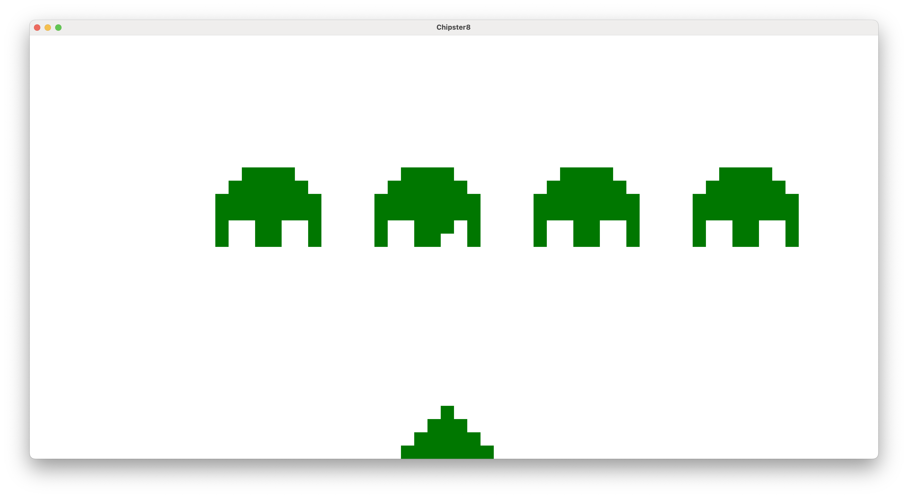

# go-chipster8

Just a quick port of [Chipster8](https://github.com/patricktcoakley/Chipster8) to Go
using [Ebitengine](https://ebitengine.org/).

## Usage

go-chipster8 takes the following arguments:

- `-romPath`: Path to the ROM file(s) to load. Can be a file or a directory. Defaults to `/roms`.
- `-scale`: The scale factor for the screen. Defaults to `25`.
- `-speed`: The speed of the emulator. Defaults to `10`.
- `-palette`: The color palette to use. Defaults to `"black"`, which is black and white.

## Controls

### Game Controls

| Chip8 | Chipster8 |
|-------|-----------|
| 1     | 1         |
| 2     | 2         |
| 3     | 3         |
| C     | 4         |
| 4     | Q         |
| 5     | W         |
| 6     | E         |
| D     | R         |
| 7     | A         |
| 8     | S         |
| 9     | D         |
| E     | F         |
| A     | Z         |
| 0     | X         |
| B     | C         |
| F     | V         |

### Menu Controls

| Feature        | Key     |
|----------------|---------|
| Move Selection | Up/Down |
| Load Selection | Enter   |

### Extra Controls

| Feature            | Key   |
|--------------------|-------|
| Pause/Resume       | Space |
| Reset              | F1    |
| Decrease Speed     | F2    |
| Increase Speed     | F3    |
| Cycle Color Scheme | F6    |
| Toggle Fullscreen  | F11   |
